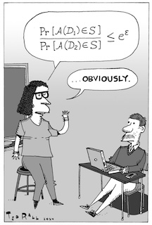

## Outline

- Who cares about privacy?
- Class grades problem
- What's "differential" about differential privacy?
- **Let's do differential privacy!**
- Hold on... We could get a negative number back?!
- Privacy budgets and epsilon
- **Privacy Deployments Registry, and a discussion**
- Return to the class grades problem
- **Experiments with DP Wizard**
- Introduction to OpenDP
- **What's the right tool for the job?**

## Who cares about privacy?

And what is my background?

### Harvard Herbaria (2013-2014)

Rare plants might only be known to grow in one location.
What geographic information can be public without giving too detail to poachers?

### Gehlenborg Lab at HMS (2016-2022)

Medical knowledge advances by generalizing from unique stories.
How can we respect the privacy of individuals while still supporting research?
Can labs without access to the original data still reproduce results?

### OpenDP Team at SEAS (2023-present)

Why I'm here!

### Old North Church (2023-present)

Debates about taxation and representation were central to the revolution! Taxes and the apportionment of representatives depend on personal information, information that people may be reluctant to volunteer. 

## Class grades problem

I'm in a class of 40 people, and the class average at midterm is 90.
I drop the class, and the teacher announces the average is now 91.
Can the other students figure out my grade?

## Class grades solution

I'm in a class of 40 people, and the class average at midterm is 90.
I drop the class, and the teacher announces the average is now 91.
Can the other students figure out my grade?

**Yes!**

```
>>> class_size = 40
>>> mean_with_me = 90.0
>>> mean_without_me = 91.0

>>> # total_without_me / (class_size - 1) = mean_without_me
>>> total_without_me = (class_size - 1) * mean_without_me

>>> # (me + total_without_me) / class_size = mean_with_me
>>> me = mean_with_me * class_size - total_without_me
>>> me
51.0

```

This "solution" is a problem! What could the teacher have done instead?

*Differential privacy* suggests adding calibrated noise before releasing statistics.

## Class grades solution problem solution problems!

Ok, but what does "adding calibrated noise" even mean?

- What probability distribution?
  - Typically Laplace or Gaussian
  - Hopefully this is handled for you by a library!
- How is it calibrated?
  - With math!
  - There's a tradeoff between accuracy and privacy.
  - The right balance will depend on context.
- What if there is another release (perhaps before the exam)?
  - We need to set a **privacy budget** and allocate it among queries.
  - Reuse information you already have to conserve your budget.

## What's "differential" about differential privacy?

<table>
<tr>
<td>

An algorithm is differentially private if by looking at the output, you cannot tell whether any individual's data was included in the original dataset or not.

Or: The behavior of the algorithm hardly changes when a single individual joins or leaves the dataset.

Or: Anything the algorithm might output on a database containing some individual's information is almost as likely to have come from a database without that individual's information.

</td>
<td>

<!-- Pr[A(D1) in S] / Pr[A(D2) in S] <= e^epsilon ... OBVIOUSLY. -->


By Ted Rall (CC-BY-NC-ND). In [_Differential Privacy_ by Simson L. Garfinkel from MIT Press](https://mitpress.mit.edu/9780262551656/differential-privacy/)

</td>
</tr>
</table>

## Randomized response

Ideas that we now identify as "DP" were in use before the term was coined: [Stanley L. Warner: "Randomized Response: A Survey Technique for Eliminating Evasive Answer Bias" (1965)](https://www.jstor.org/stable/2283137)

Here's a question I might not feel comfortable answering honestly:

> Are you at the Harvard IT Summit mostly for the free lunch?

- Decide on your answer.
- Then flip a coin.
- If it's tails, flip again.
- Use this table to respond:

| final:  | heads | tails |
|---------|-------|-------|
| **yes** | A     | B     |
| **no**  | B     | A     |

## Let's do differential privacy

What does it look like in the limit?

|         |       |       |
|---------|-------|-------|
| **yes** | A: 3/4 | B: 1/4 |
| **no**  | B: 3/4 | A: 1/4 |

Given the fraction "A", solve for fraction "yes".

```
A% = 3/4 * Y% + 1/4 * N%
A% = 3/4 * Y% + 1/4 * (1 - Y%)
A% = 1/2 * Y% + 1/4
2 * (A% - 1/4) = Y% 
```

| A% | Y% |  |
|----|----|--|
| 25% | 0% |  |
| 50% | 50% | 👉 These are noisy estimates!
| 75% | 100% |  |

## Hold on... We could get a negative number back?!

<table>
<tr>
<td>

| A% | Y% |
|----|----|
| 0% | -50% |
| 25% | 0% |
| 50% | 50% |
| 75% | 100% |
| 100% | 150% |

</td>
<td>

### What does this mean?

### How do we explain it to users?

</td>
</tr>
</table>

## What does this mean?

<table>
<tr>
<td>

| A% | Y% |
|----|----|
| 0% | -50% |
| 25% | 0% |
| 50% | 50% |
| 75% | 100% |
| 100% | 150% |

</td>
<td>

### This is one draw from a random distribution

<!-- If the true value is 0, we could still draw a value here or here! -->


### If we combine this number with others, negative values produce more accurate results

Imagine all the sessions make their own DP estimate:
If we clipped each value at zero, the mean will be biased.

</td>
</tr>
</table>

## How do we explain it to users?

[Bloomberg, August 12, 2021: "Data Scientists Square Off Over Trust and Privacy in 2020 Census"](https://www.bloomberg.com/news/articles/2021-08-12/data-scientists-ask-can-we-trust-the-2020-census)

> New York’s Liberty Island, population 0, has emerged as the unlikely center of a tug-of-war over the U.S census.
>
>Aside from the Statue of Liberty, no one’s called the island home since 2012, when the former superintendent’s home was destroyed by Hurricane Sandy, leaving Liberty Island unoccupied for the first time in hundreds of years.
>
>Quasi-officially, though, the current population for the 12-acre island stands at 48.

Questions:

- How would you explain our here-for-the-free-lunch stat?
- How could we make it more accurate?

## How can we improve accuracy?

- Recruit more study participants.
  - May not be an option.
  - But, sampling itself is a source of randomness: "privacy amplification"
- Instead of having every person randomize their response, we could collect all the data, and then only apply noise once.
  - This is changing the model, from **local** to **central** DP.

<table>
<tr>
<td>

Who do we trust?

</td>
<td>

| Individuals | Authority | Public |   |
|-------------|-----------|--------|---|
| ✓ |   |   | Local DP |
| ✓ | ✓ |   | Central DP |
| ✓ | ✓ | ✓ | No DP! |

</td>
</tr>
</table>

- Instead of using a fair coin, we could randomize the response less than 50% of the time.
  - We're changing the trade-off between privacy and accuracy, the "Privacy Budget".

## Privacy budgets and epsilon

<table>
<tr>
<td>

<!-- Pr[A(D1) in S] / Pr[A(D2) in S] <= e^epsilon ... OBVIOUSLY. -->


odds ratio ≤ e<sup>ε</sub>

<i>log</i>(odds ratio) ≤ ε

</td>
<td>

- If ε=1, even odds that my record is in the dataset.
- ε is on a log scale, and smaller values are safer.
- If two calculations consume ε<sub>1</sub> and ε<sub>2</sub>, together they consume ε<sub>1</sub> + ε<sub>2</sub>.
- ε is proven worst case bound: Research is tightening the bounds on existing mechanisms, and developing new mechanisms which are more efficient.
- The "right" value of ε in a given situation is social question.
- We can use the [Privacy Deployments Registry](https://registry.oblivious.com/#registry) to see what other people have used.

</td>
</tr>
</table>

## Privacy Deployments Registry, and a discussion

A sample from [`registry.oblivious.com`](https://registry.oblivious.com/#registry):

| Organization | Epsilon | Context |
|--------------|---------|---------|
| Microsoft | 0.1 | [Broadband Coverage Estimates](https://arxiv.org/pdf/2103.14035) |
| Wikimedia Foundation | 1.0 | [Wikipedia Usage Data](https://arxiv.org/abs/2308.16298)
| US Census | 19.61 | [Disclosure Avoidance System for Redistricting Data](https://www.census.gov/newsroom/press-releases/2021/2020-census-key-parameters.html) |

**Five minute discussion:** Break into groups and...

- Give examples of private data with public applications, ideally something from your own experience.
- Pick one of these and identify who would be interested in more accurate statistics, and who would prefer more privacy.
- Finally, how can these two competing interests be represented? Does everyone have a seat at the table?

## Return to the class grades example

... but to make it more interesting, look at histograms of letter grades, instead of just finding a mean.

**[`pip install dp_wizard`](https://pypi.org/project/dp_wizard/), and analyze your own private CSVs locally,**

**... or go to [`https://dp-wizard.opendp.org`](https://dp-wizard.opendp.org/) and only provide column names.**

Then:

<table>
<tr>
<td style="vertical-align: top;">

- On "Select Dataset":
    - Just one column, `grade`.
    - Leave the "unit of privacy" at 1.
    - Click "Define Analysis".

</td>
<td style="vertical-align: top;">

- On "Define Analysis":
    - Leave "Group By" empty.
    - Select `grade` in "Columns".
    - Leave "Privacy Budget" at 1, and "Number of Rows" at 100.
- On the histogram:
    - Change the upper bound to 100.

</td>
</tr>
</table>

## DP Wizard experiments

For 5 minutes, experiment with one parameter, and then pick someone to summarize your the result of your changes on the _accuracy_ of the DP statistics.

<table>
<tr>
<td>

**Group A:** Imagine that rather than protecting the privacy of individual students, we're interested in the privacy of student groups. What would we change?

**Group B:** Imagine we were just interested in pass/fail instead of letter grades. What can we change?

</td>
<td>

**Group C:** Given what we know about the typical distribution of grades, is there something we can change to use our privacy budget more efficiently?

**Group D:** What if we were interested in grades across the entire school, instead of just one class? (Bonus: Why do you think the UI asks for an "estimate" of the number of rows?)

</td>
</tr>
</table>

## Introduction to the OpenDP library

Note the "Code sample" fold-downs: These are Python code snippets that demonstrate the OpenDP library. We can also download a complete example.

<hr>

### OpenDP Demo

This is a demonstration of how the OpenDP Library can be used to create a differentially private release. To learn more about what's going on here, see the documentation for OpenDP: https://docs.opendp.org/

#### Prerequisites

First install and import the required dependencies:

```
%pip install 'opendp[polars]==0.13.0' matplotlib
```
```
>>> import polars as pl
>>> import opendp.prelude as dp
>>> import matplotlib.pyplot as plt
>>>
>>> # The OpenDP team is working to vet the core algorithms.
>>> # Until that is complete we need to opt-in to use these features.
>>> dp.enable_features("contrib")

```

## Utility functions

Then define some utility functions to handle dataframes and plot results:

```
>>> # These functions are used both in the application
>>> # and in generated notebooks.
>>> from polars import DataFrame
>>> 
>>> 
>>> def make_cut_points(
...     lower_bound: float, upper_bound: float, bin_count: int
... ):
...     """
...     Returns one more cut point than the bin_count.
...     (There are actually two more bins, extending to
...     -inf and +inf, but we'll ignore those.)
...     Cut points are evenly spaced from lower_bound to upper_bound.
...     >>> make_cut_points(0, 10, 2)
...     [0.0, 5.0, 10.0]
...     """
...     bin_width = (upper_bound - lower_bound) / bin_count
...     return [
...         round(lower_bound + i * bin_width, 2)
...         for i in range(bin_count + 1)
...     ]

```

## Analysis

Based on the input you provided, for each column we'll create a Polars expression that describes how we want to summarize that column.

### Expression for `grade`

```
>>> # See the OpenDP docs for more on making private histograms:
>>> # https://docs.opendp.org/en/stable/getting-started/examples/histograms.html
>>> 
>>> # Use the public information to make cut points for 'grade':
>>> grade_cut_points = make_cut_points(
...     lower_bound=0.0,
...     upper_bound=100.0,
...     bin_count=10,
... )
>>> 
>>> # Use these cut points to add a new binned column to the table:
>>> grade_bin_expr = (
...     pl.col("grade")
...     .cut(grade_cut_points)
...     .alias("grade_bin")  # Give the new column a name.
...     .cast(pl.String)
... )

```

## Context

Next, we'll define our Context. This is where we set the privacy budget, and set the weight for each query under that overall budget.

```
>>> contributions = 1
>>> privacy_unit = dp.unit_of(contributions=contributions)
>>> 
>>> # Consider how your budget compares to that of other projects.
>>> # https://registry.oblivious.com/#public-dp
>>> privacy_loss = dp.loss_of(
...     epsilon=1.0,
...     delta=1e-7,
... )
>>> 
>>> # See the OpenDP docs for more on Context:
>>> # https://docs.opendp.org/en/stable/api/user-guide/context/index.html#context:
>>> context = dp.Context.compositor(
...     data=pl.scan_csv(
...         "fill-in-correct-path.csv", encoding="utf8-lossy"
...     ).with_columns(grade_bin_expr),
...     privacy_unit=privacy_unit,
...     privacy_loss=privacy_loss,
...     split_by_weights=[2],
...     margins=[
...         # "max_partition_length" should be a loose upper bound,
...         # for example, the size of the total population being sampled.
...         # https://docs.opendp.org/en/stable/api/python/opendp.extras.polars.html#opendp.extras.polars.Margin.max_partition_length
...         #
...         # In production, "max_num_partitions" should be set by considering the number
...         # of possible values for each grouping column, and taking their product.
...         dp.polars.Margin(
...             by=[],
...             public_info="keys",
...             max_partition_length=1000000,
...             max_num_partitions=100,
...         ),
...         dp.polars.Margin(
...             by=[
...                 "grade_bin",
...             ],
...             public_info="keys",
...         ),
...     ],
... )

```

## A note on character encodings

A note on `utf8-lossy`: CSVs can use different "character encodings" to represent characters outside the plain ascii character set, but out of the box the Polars library only supports UTF8. Specifying `utf8-lossy` preserves as much information as possible, and any unrecognized characters will be replaced by "�". If this is not sufficient, you will need to preprocess your data to reencode it as UTF8.

## Results

Finally, we run the queries and plot the results.

```
>>> confidence = 0.95  # 95% confidence interval

```

Query for grade:

```
>>> groups = ["grade_bin"] + []
>>> grade_query = context.query().group_by(groups).agg(pl.len().dp.noise())
>>> grade_accuracy = grade_query.summarize(alpha=1 - confidence)[
...     "accuracy"
... ].item()
>>> grade_stats = grade_query.release().collect()
>>> grade_stats # doctest: +ELLIPSIS
shape: (..., 2)
┌───────────┬─────┐
│ grade_bin ┆ len │
│ ---       ┆ --- │
│ str       ┆ u32 │
╞═══════════╪═════╡
...
└───────────┴─────┘

```

If we try to run more queries at this point, it will error. Once the privacy budget is consumed, the library prevents you from running more queries with that Queryable.

## OpenDP architecture

TODO: Layer cake diagram; Point out that some R support is available, but not API just demonstrated.

## Beyond just releasing a single number

TODO?

- PCA
- Synthetic data
- Regression
- 

## Limitations of DP

### Less accurate stats...

What is the alternative? If people lose confidence in the way their data is handled, then they may be less willing to participate in the future.

Ad hoc anonymization is risky, and might introduce biases that are less well chacterized.

### Less flexible workflow...

If you let yourself be too flexible, there's a risk of p-hacking.

The methodology that DP imposes is similar to what we should be doing in any case if we want our research to be reproducible.

## Relationship to other PETs

TODO

## Wrap up

If there's time, gather the groups again, and revisit the examples you gave earlier. Would you approach them differently now?